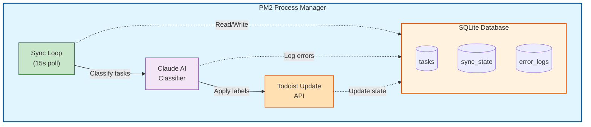

# Todoist Autolabel Service

An intelligent task classification service for Todoist that automatically labels tasks in your Inbox using Claude AI.

## Features

- **Incremental Sync**: Efficiently polls Todoist every 15 seconds using incremental sync
- **Claude AI Classification**: Uses Claude API for accurate, reliable task classification
- **Structured Outputs**: Guarantees valid JSON responses with schema-constrained label selection
- **Configurable Model**: Choose between different Claude models based on speed/quality needs
- **SQLite Persistence**: Tracks classification state and errors in a local database
- **PM2 Management**: Production-ready with automatic restarts and log management
- **Inbox-Only Processing**: Only classifies tasks in your Todoist Inbox

## Quick Start

### 1. Install Dependencies

```bash
pnpm install
pnpm install -g pm2
```

### 2. Configure Environment

Create a `.env` file:

```bash
TODOIST_API_TOKEN=your_token_here
ANTHROPIC_API_KEY=your_key_here
```

### 3. Build and Run

```bash
pnpm run build
pnpm run pm2:start
```

## Documentation

- [Setup Guide](./docs/setup.md) - Installation and configuration
- [Deployment Guide](./docs/deployment.md) - PM2 management and operations

## Architecture



## How It Works

1. **Poll**: Every 15 seconds, syncs with Todoist using incremental sync
2. **Filter**: Only processes new/changed tasks in the Inbox
3. **Classify**: Sends task to Claude API with your label taxonomy using Structured Outputs
4. **Apply**: Updates task labels in Todoist
5. **Track**: Records classification state in SQLite

### Structured Outputs

The classifier uses Claude's [Structured Outputs](https://docs.anthropic.com/en/docs/build-with-claude/structured-outputs) feature to guarantee valid JSON responses. This ensures:

- **Always valid JSON**: No parsing errors or malformed responses
- **Schema-constrained labels**: Only labels from your taxonomy can be returned
- **No retries needed**: Eliminates retry logic for schema violations

## Scripts

| Command | Description |
|---------|-------------|
| `pnpm run build` | Compile TypeScript |
| `pnpm run dev` | Run in development mode |
| `pnpm run pm2:start` | Start with PM2 |
| `pnpm run pm2:stop` | Stop PM2 process |
| `pnpm run pm2:restart` | Restart PM2 process |
| `pnpm run pm2:logs` | View PM2 logs |
| `pnpm run pm2:status` | Check PM2 status |

## Configuration

Environment variables (`.env`):

| Variable | Default | Description |
|----------|---------|-------------|
| `TODOIST_API_TOKEN` | Required | Todoist API token |
| `ANTHROPIC_API_KEY` | Required | Claude API key |
| `ANTHROPIC_MODEL` | `claude-sonnet-4-5-20250929` | Claude model to use |
| `MAX_LABELS_PER_TASK` | `5` | Max labels per task |
| `POLL_INTERVAL_MS` | `15000` | Polling interval |
| `MAX_ERROR_LOGS` | `1000` | Max error log entries |
| `DB_PATH` | `./data/todoist.db` | Database path |
| `LOG_LEVEL` | `info` | Log verbosity |

### Available Models

| Model | Speed | Cost | Best For |
|-------|-------|------|----------|
| `claude-sonnet-4-5-20250929` | Fast | ~$3/1M tokens | Recommended default |
| `claude-opus-4-20250514` | Slower | ~$15/1M tokens | Complex taxonomies |

> **Note**: Structured Outputs requires Claude Sonnet 4.5 or Claude Opus 4. Other models are not supported.

## Labels

Labels are defined in `./labels.json`. The service will classify tasks using these labels. The Structured Outputs feature ensures Claude can only return labels that exist in your taxonomy.

## License

ISC
