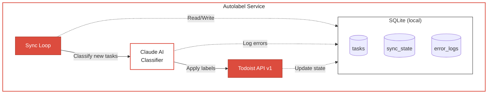

# @glorioustephan/todoist-autolabel

[](https://github.com/glorioustephan/todoist-autolabel-service/actions/workflows/ci.yml)
[](https://www.npmjs.com/package/@glorioustephan/todoist-autolabel)
[](./LICENSE)

> Automatically classify and label Todoist Inbox tasks with Claude AI using **Structured Outputs** — guaranteed-valid label assignments, no retry parsing, no malformed JSON.

This package ships both a turn-key **CLI** you can run as a long-lived daemon, and a **library** you can embed in your own Node process.

```bash
npx @glorioustephan/todoist-autolabel
```

---

## Features

- **Inbox-only classification** — leaves your organized projects alone, attacks the bottom of the funnel.
- **Claude Structured Outputs** — labels are constrained to your taxonomy at decode time, so the model can never invent a label or return malformed JSON.
- **Cursor-paginated sync** — talks to the new Todoist API v1 (the v9 REST API was deprecated in February 2026).
- **Stateful retries** — a local SQLite DB tracks attempts so transient failures don't get stuck or duplicated.
- **CLI + library** — `npx`-runnable daemon, or `import` the pieces you need.
- **Cheap** — defaults to **Claude Haiku 4.5**, ~$1 / $5 per 1M input/output tokens.

## Architecture


```mermaid
graph TB
    subgraph Service["Autolabel Service"]
        SyncLoop["Sync Loop"]
        Claude["Claude AI<br/>Classifier"]
        Todoist["Todoist API v1"]

        SyncLoop -->|Classify new tasks| Claude
        Claude -->|Apply labels| Todoist

        subgraph DB["SQLite (local)"]
            Tasks[(tasks)]
            SyncState[(sync_state)]
            ErrorLogs[(error_logs)]
        end

        SyncLoop -.->|Read/Write| DB
        Claude -.->|Log errors| DB
        Todoist -.->|Update state| DB
    end

    style Service fill:#ffffff,stroke:#DC4C3E,stroke-width:2px,color:#202020
    style DB fill:#ffffff,stroke:#202020,stroke-width:1px
    style SyncLoop fill:#DC4C3E,stroke:#A02E20,color:#ffffff
    style Claude fill:#ffffff,stroke:#DC4C3E,stroke-width:2px,color:#202020
    style Todoist fill:#DC4C3E,stroke:#A02E20,color:#ffffff
```

## Quick start (CLI)

### 1. Install

```bash
# As a one-off:
npx @glorioustephan/todoist-autolabel

# Or pinned in a project:
pnpm add @glorioustephan/todoist-autolabel
```

### 2. Create `.env` and `labels.json` in your working directory

`.env`:

```bash
TODOIST_API_TOKEN=your_todoist_api_token
ANTHROPIC_API_KEY=your_anthropic_api_key

# All optional:
ANTHROPIC_MODEL=claude-haiku-4-5-20251001
MAX_LABELS_PER_TASK=5
POLL_INTERVAL_MS=300000
LOG_LEVEL=info
```

`labels.json` (copy [`labels.example.json`](./labels.example.json) as a starting point):

```json
{
  "labels": [
    { "name": "urgent",   "color": "red" },
    { "name": "waiting",  "color": "grey" },
    { "name": "errands",  "color": "red" }
  ]
}
```

> Every label here must already exist in Todoist with the same name. The example file uses Todoist's `red` / `berry_red` / `grey` / `charcoal` named colors to match the Todoist brand palette.

### 3. Run

```bash
npx @glorioustephan/todoist-autolabel
```

The CLI runs forever, polling Todoist every `POLL_INTERVAL_MS` (default 5 minutes). Stop it with `Ctrl+C`.

## Quick start (library)

```ts
import {
  loadConfig,
  initDatabase,
  initTodoistApi,
  initClassifier,
  initSyncManager,
  getSyncManager,
} from '@glorioustephan/todoist-autolabel';

const config = loadConfig();           // pulls from process.env + CWD .env
initDatabase(config);
await initTodoistApi(config);

const classifier = await initClassifier(config);
if (!classifier.success) throw new Error(classifier.error);

initSyncManager(config);
await getSyncManager().sync();         // run one cycle
```

Every function returns either a value or a `Result<T, E>` — there's no surprise throwing.

## Configuration

All configuration is environment-driven. The CLI looks for a `.env` file in the **current working directory** (`process.cwd()`), not the install location.

| Variable              | Default                                    | Description                                                |
| --------------------- | ------------------------------------------ | ---------------------------------------------------------- |
| `TODOIST_API_TOKEN`   | **required**                               | Todoist API token (Settings → Integrations → Developer)    |
| `ANTHROPIC_API_KEY`   | **required**                               | Anthropic API key                                          |
| `ANTHROPIC_MODEL`     | `claude-haiku-4-5-20251001`                | Any Claude model that supports Structured Outputs          |
| `MAX_LABELS_PER_TASK` | `5`                                        | Hard cap on labels applied per task                        |
| `POLL_INTERVAL_MS`    | `15000`                                    | Polling interval in ms (raise for less Todoist API churn)  |
| `MAX_ERROR_LOGS`      | `1000`                                     | FIFO cap on the local error log                            |
| `DB_PATH`             | `<cwd>/data/todoist.db`                    | SQLite database location                                   |
| `LABELS_PATH`         | `<cwd>/labels.json`                        | Path to your label taxonomy                                |
| `LOG_LEVEL`           | `info`                                     | `debug` &#124; `info` &#124; `warn` &#124; `error`         |

### Supported Claude models

Structured Outputs is supported on **Claude Haiku 4.5+, Sonnet 4.5+, and Opus 4+**. ([Anthropic docs](https://platform.claude.com/docs/en/build-with-claude/structured-outputs))

| Model                            | Speed   | Cost (in/out per 1M tok) | Best for                       |
| -------------------------------- | ------- | ------------------------ | ------------------------------ |
| `claude-haiku-4-5-20251001`      | Fastest | ~$1 / ~$5                | Recommended default            |
| `claude-sonnet-4-5-20250929`     | Fast    | ~$3 / ~$15               | Higher-accuracy classification |
| `claude-opus-4-20250514`         | Slower  | ~$15 / ~$75              | Large or ambiguous taxonomies  |

## How it works

1. **Poll** — Every `POLL_INTERVAL_MS`, fetch the Inbox via the Todoist API v1.
2. **Filter** — Skip completed tasks and tasks that already have any labels.
3. **Classify** — Send `(content, description, available_labels[])` to Claude with a JSON-schema-constrained `output_format`. The model can only emit names from your taxonomy.
4. **Apply** — Patch labels back to Todoist.
5. **Track** — Record the attempt in SQLite (success, retry, or permanent fail after 3 tries).

The classifier uses Claude's Structured Outputs beta header, so JSON parsing is guaranteed — no schema-violation retries needed.

## Project layout (for embedders)

```
src/
├── service.ts        # CLI entry point (#!/usr/bin/env node)
├── index.ts          # Library public surface (exports below)
├── config.ts         # Env-driven configuration
├── database.ts       # SQLite persistence
├── todoist-api.ts    # @doist/todoist-sdk wrapper
├── classifier.ts     # Claude classifier (Structured Outputs)
├── sync.ts           # Sync orchestration
├── logger.ts         # Levelled logger (chalk)
└── types.ts          # Branded IDs, Result<T,E>, domain types
```

Public exports: `loadConfig`, `getConfig`, `resetConfig`, `createLogger`, `getLogger`, `initDatabase`, `getDatabase`, `closeDatabase`, `TodoistApiManager`, `initTodoistApi`, `getTodoistApi`, `resetTodoistApi`, `initClassifier`, `getClassifier`, `resetClassifier`, `SyncManager`, `initSyncManager`, `getSyncManager`, `resetSyncManager`, plus all domain types from `./types.js`.

## Running as a daemon (optional)

The CLI is just a long-running Node process — pair it with whatever process manager you already use (systemd, launchd, pm2, Docker). The repo includes a sample `ecosystem.config.cjs` for [PM2](https://pm2.keymetrics.io/); see [`docs/deployment.md`](./docs/deployment.md) for details. The PM2 config is **not** published to npm.

## Contributing

See [`CONTRIBUTING.md`](./CONTRIBUTING.md). TL;DR:

- Conventional Commits (`pnpm run commit` opens a Commitizen prompt).
- `pnpm typecheck && pnpm test` before opening a PR.
- Releases are automated via [release-please](https://github.com/googleapis/release-please).

## License

[MIT](./LICENSE) © glorioustephan
